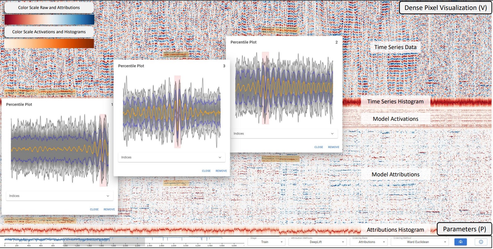

# Dense-Pixel Views for Attribution Techniques on Time Series (DAVOTS)



DAVOTS visualizes raw time series data, activations of a selected layer, and attributions in a dense pixel visualization using image generation for whole time series datasets on trained models.

Through such a visualization, patterns in the data and the explanations can be revealed.
For instance, patterns the neural network learns for the classification of samples.

MLVIS 2023 freeze: [076dffd54a1197da9bb88411887b7290fcae81cf](https://github.com/visual-xai-for-time-series/dense-time-series-attributions/tree/076dffd54a1197da9bb88411887b7290fcae81cf)

EUROVIS 2024 current WIP.

### Data and Model to explore:

Dataset: Ford A (Training: 3601 / Test: 1320)  
Model: 3 Conv1D (5, 10, 50, kernel=3, stride=2), 2 FC (100, 2)  
Attribution: IntegratedGradients, ShapleyValueSampling  
Activations: 100 FC

Check the `preprocessing` directory and `preprocessing.py` script.

## Start the application

You can start the application using:  
`docker-compose up`  
and go to `localhost` to use and explore the application.

## Extend with other data

You can rerun the preprocessing script with other data or models.

## Development

For further development, you can make use of the yarn (react-scripts) server with:  
`docker-compose -f docker-compose-dev.yaml up`  
and go to `localhost:3000`.

## Libraries

Frontend:

-   React (https://reactjs.org/)
-   React MUI (https://mui.com/)

Backend:

-   Python v3.10
-   FastAPI (https://fastapi.tiangolo.com/)
-   Pillow (https://pillow.readthedocs.io/en/stable/)
-   Pytorch (https://pytorch.org/)
-   Captum (https://captum.ai/)
-   Numpy (https://numpy.org/)
-   Scipy (https://scipy.org/)
-   Pandas (https://pandas.pydata.org/)

## License

Released under MIT License. See the LICENSE file for details.

## Reference

```
@conference{,
 author = {Schlegel, Udo and Keim, Daniel A.},
 booktitle = {Machine Learning Methods in Visualisation for Big Data (MLVIS) 2023 @ EuroVis 2023},
 title = {Interactive dense pixel visualizations for time series and model attribution explanations},
 year = {2023}
}
```

